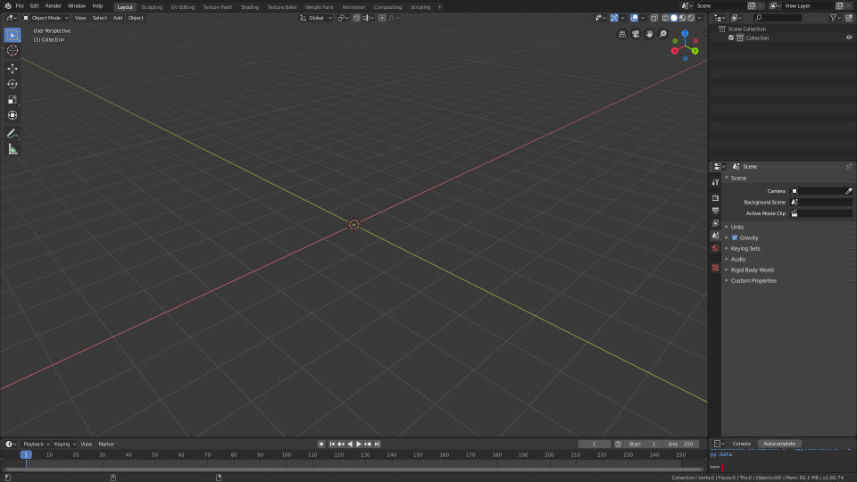
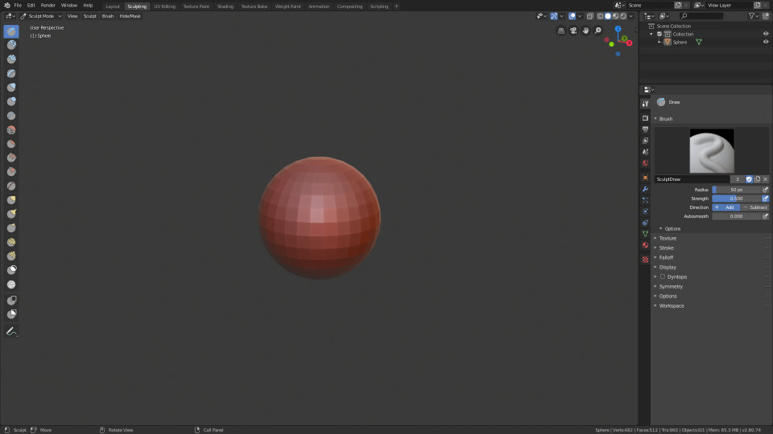
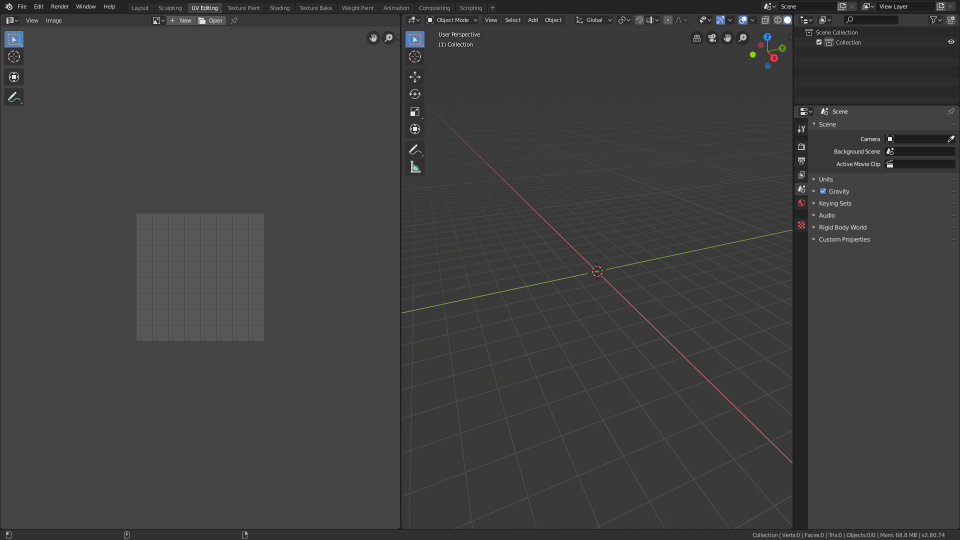
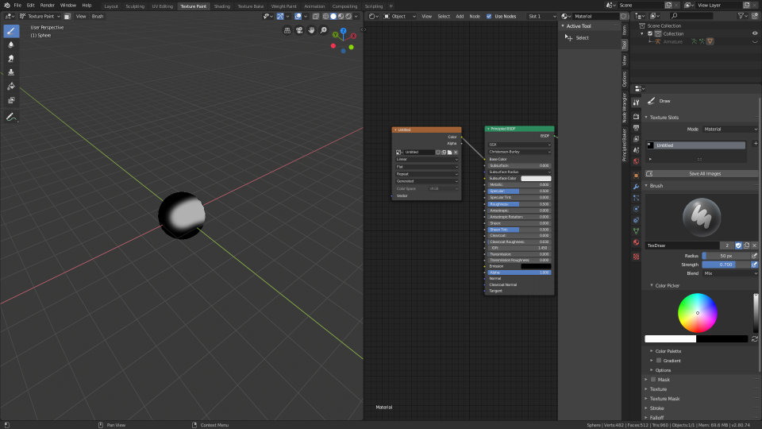
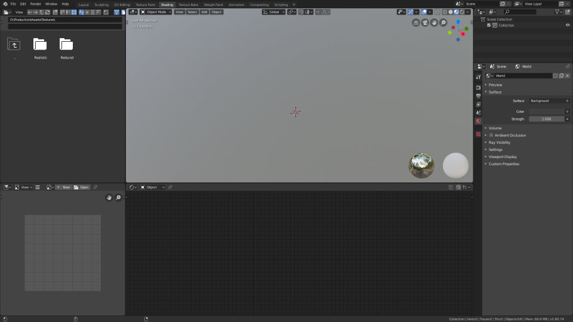
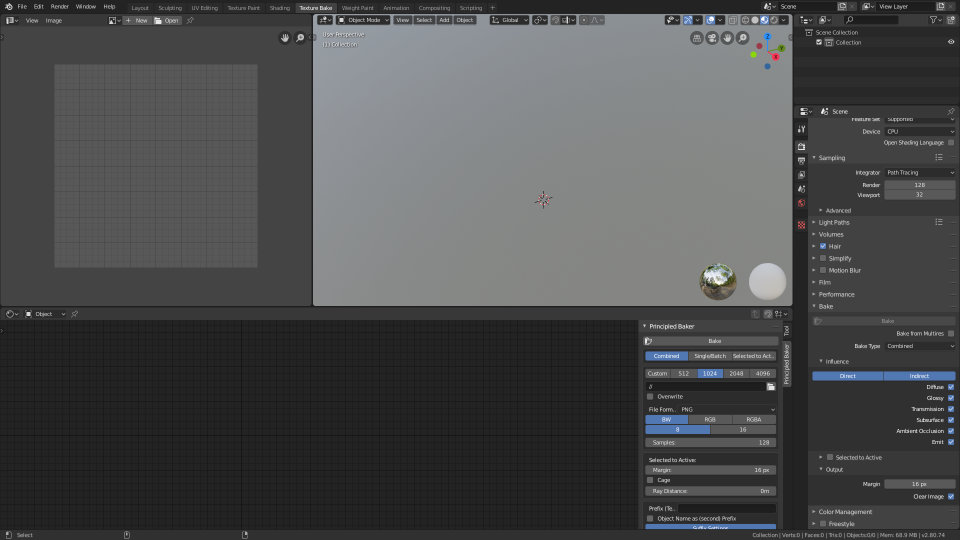
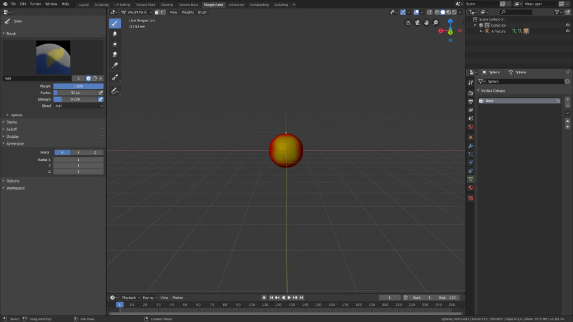
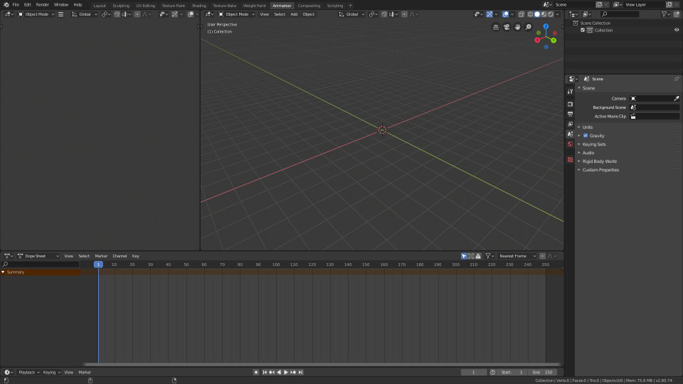
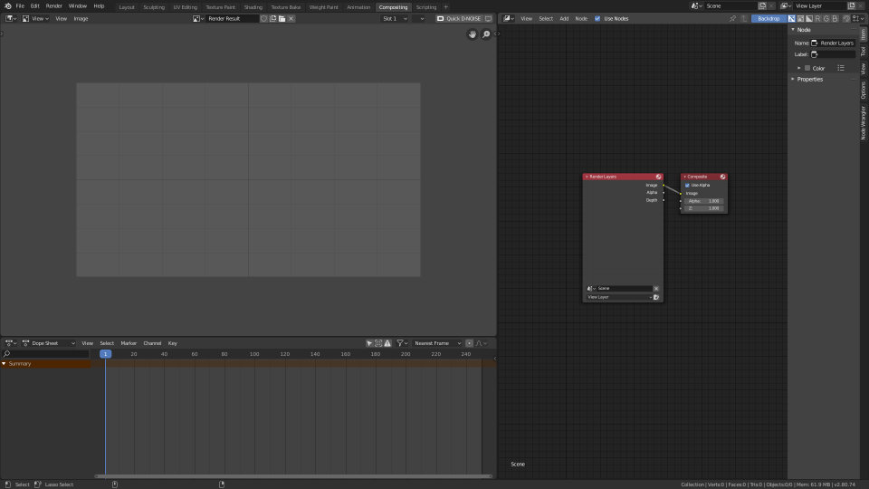
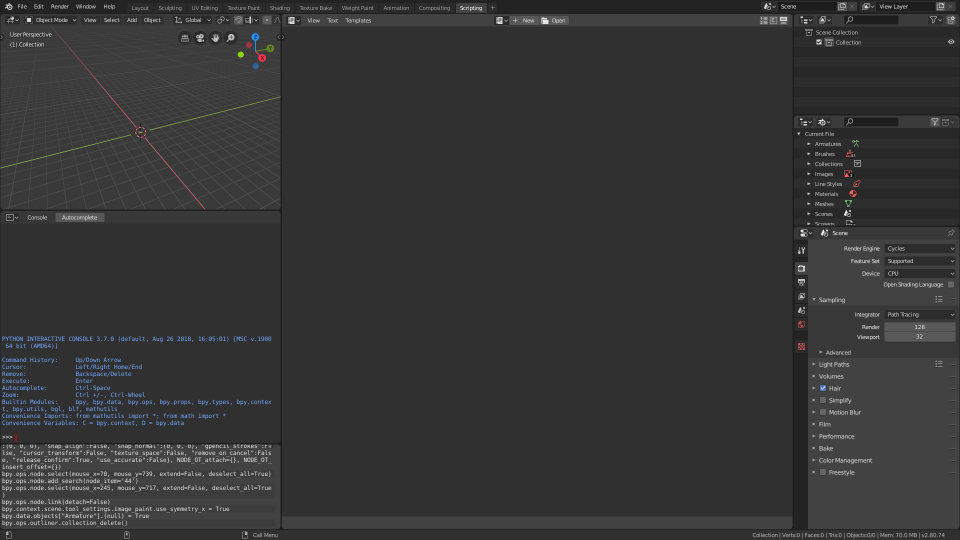

# Personal Blender Configuration

## User Preferences

My user preferences are almost equal to the defaults. I unchecked *Load UI* in *Save & Load* to prevent Blender from loading workspaces from other files.
Also, I am using *C:\Windows\Fonts* as *Fonts* directory and my keymapping is the one described in [Keymap](#keymap) of course.

I will not go into my add-on configuration. I just hope it doesn't mess with yours if you decide to use my preferences.

## Keymap

My keymap slightly differs from the default:
- I use *Gizmos* as tilde action.
- I changed *Window* > *Search Menu* from F3 to Alt+Spacebar.
- I added *Node Generic* > *Search and Add Node*  for Tab.

## Startup File

Open startup.blend in Blender and use *File > Defaults > Save Startup File* to set it as your own startup file.

This startup file is structured into ten workspaces:

- [Layout](#layout)
- [Sculpting](#sculpting)
- [UV Editing](#uv-editing)
- [Texture Paint](#texture-paint)
- [Shading](#shading)
- [Texture Bake](#texture-bake)
- [Weight Paint](#weight-paint)
- [Animation](#animation)
- [Compositing](#compositing)
- [Scripting](#scripting)

Some workspaces are added by me, others are either modified or stock versions of the default workspaces from Blender.
Below you can find screenshots and descriptions to all of those workspaces.

I will update this file whenever a significant amount of change happened in its structure.

### Layout

This is a slightly modified version of Blender's default Layout workspace. I use it for everything I don't have a specific workspace for, including modelling.

### Sculpting

This is the default Sculpting workspace.

### UV Editing

This is the default UV Editing workspace.

### Texture Paint

This is a modified version of the Texture Paint workspace.
I got rid of the UV editor and added a node editor as I never used the UV editor for painting and I wanted an easy way to select images via node editor. Symmetry is set to X by default as well.

### Shading

This workspace is almost equal to the default Shading workspace.

### Texture Bake

This one is very similar to the Shading workspace, but with a bit more space for the node editor. I use it for baking textures with Cycles and the [Principled Baker](https://github.com/danielenger/Principled-Baker) add-on.

### Weight Paint

This workspace is optimized for weight painting. On the left are the brush settings and on the right is an expanded list of all vertex groups to easily select the different bone weights. Symmetry settings are opened by default to check right away if they are enabled.

### Animation

This workspace is very similar to the default Animation workspace.

### Compositing

The Compositing workspace is a customized version of its default. I rearranged the editors and added an image viewer showing Render Result by default to see the Composite output there without any nodes covering it. I wanted to create a good mix of Blender's and Nuke's compositing workspace.

### Scripting

This is the default Scripting workspace.
